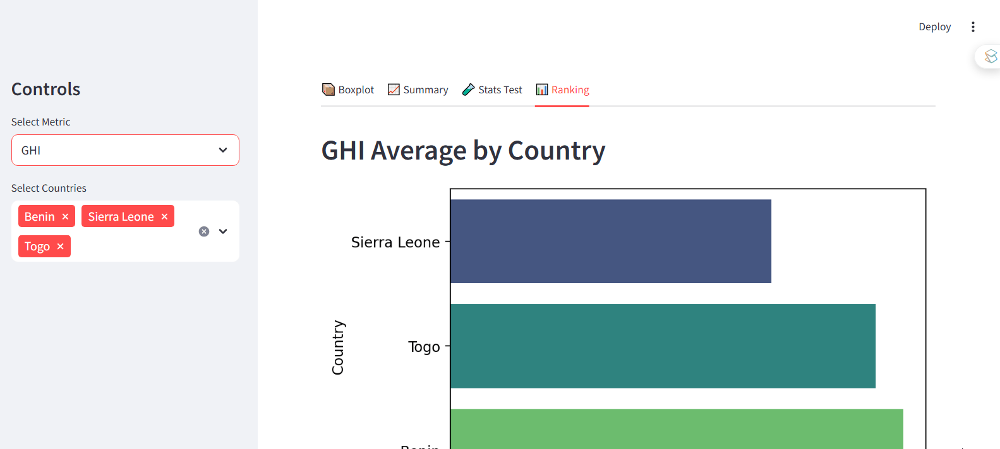

# Interactive Web App with StreamlitUI to show Cross Country Comparision
This Streamlit UI to visualize the cleaned dataset of three countries benin, sierraleone, and togo. 
The dashboard is ease of use and it has clear label and navigation.
It also includes streamlit widgets to enhance user engagment.
The design shows insights for effective communicatin.
I have also deployed it and can be found [!StreamLit UI](https://tegbiye-solar-challenge-week1-appmain-dashboard-dev-swy6bo.streamlit.app/)

## Preview


## Here the steps to implement the whole project Solar challenge week1
### Clone the repository
  ```console
  git clone https://github.com/tegbiye/solar-challenge-week1.git
  ```
### Change to the directory
  ```console
  cd solar-challenge-week1
  ```
### Create virtual Environment
  ```console
  python3 -m venv .venv
  ```
#### Windows
  ```console
  .venv/Scripts/activate
  ```
#### Linux or mac
  ```console
  source: .venv/bin/activate
  ```
  
## Installation
  ```Console
  pip install -r requirements.txt
  ```
## Usage
Run
```console
streamlit run main.py
```